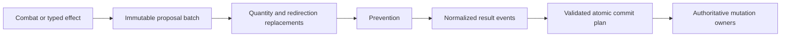

# Damage transaction

All represented combat and noncombat damage uses one prepare-and-commit
transaction. Producers submit immutable source, recipient, amount, and event
identity values. `damage.py` coordinates preparation; `damage_results.py` owns
normalized CR 120.3 result materialization, commit planning, and authoritative
result mutation.

## Proposal and preparation

Combat snapshots freeze the relevant public relationships and effective
characteristics before a pilot decision is issued. Assignment validation owns
legal recipients, totals, canonical source and recipient order, lethal
thresholds, and trample spill. Client JSON order is never authoritative.
Noncombat producers use the same immutable damage values and stable physical
or logical source identities.

Fixed simultaneous affected-set instructions compile to an immutable ordered
group descriptor. `fixed_damage_set_model.py` owns its closed player and
permanent vocabulary; `fixed_damage_set.py` materializes current public
effective-characteristic rows through a narrow query port. The snapshot uses
APNAP controller order plus stable logical object identity, excludes phased-out
objects, and deduplicates overlapping groups before creating proposals. Every
recipient then enters one `resolve_damage_batch` call, so replacement,
prevention, result, trigger, rollback, and replay behavior cannot diverge from
single-target or combat damage.

Preparation discovers applicable runtime components against the current
event, validates the affected player or permanent controller, records any
replacement choices, and rediscoveries after each transformation. Redirection
substitutes a complete recipient value before the loop continues. Prevention
then consumes the resulting event through the separate
[prevention transaction](prevention.md).

## Results and commit

Only positive final damage produces result events. The result planner derives
the typed consequences for life, marked damage, defense, loyalty, commander
damage, lifelink, deathtouch, infect, wither, toxic, and other represented
families. It validates all recipients and source snapshots before any state
changes. Resolved Infect, Wither, and Toxic leaves delegate their final
placement plan to `counter_placement.py` without rediscovering replacement
effects already exhausted by the containing damage-result tree. Planeswalker
loyalty and Battle defense delegate exact removals to `counter_removal.py`;
life changes remain with `life_state.py`. `damage_results.py` coordinates those
typed plans with marked-damage and deathtouch state, but no longer owns a
parallel generic counter-state commit. Every owner validates before the first
write, so a malformed event or stale logical incarnation leaves the complete
life, placement, removal, and permanent-result batch unchanged.

State-based actions consume temporal damage markers according to their own
owner. Damage code does not perform unrelated state-based checks or bypass
focused life, counter, or permanent-state mutation boundaries.

Each positive final damage result also appends one typed current-turn history
fact after the containing result plan commits. The fact preserves the source
logical incarnation and, for a permanent recipient, the recipient logical
incarnation. Player and permanent results share this one damage transaction;
zero and fully prevented damage append nothing. Current target predicates may
query these public facts, while a zone change invalidates the old incarnation
without deleting replay history.

## Replay, privacy, and extension

Event IDs derive from stable damage-step, source-incarnation, recipient, and
amount values rather than submission order. Continuations persist the option
set, chooser, selections, and projected modifier state. A seat sees only
authorized option labels and public facts; immutable event payloads remain in
the authoritative continuation. Replay rebuilds the transaction and must reach
the same state hash.

Add a damage family by defining a typed descriptor and immutable operation,
registering exact capability dependencies, integrating it at one transaction
stage, and adding multiplayer ordering, rollback, privacy, replay, and mutation
witnesses. Card-name or Oracle-ID branches are not permitted in the generic
transaction.

The fixed-set grammar currently covers positive fixed damage to closed player,
creature, planeswalker, opponent-controlled, flying, color-qualified,
nonartifact, nontoken, and shadow sets. Divided or variable damage, negative
keyword or subtype predicates, multiple independent damage instructions,
unpreventable wording, and linked life/draw/scry/conditional riders remain
compiler residuals. Do not widen the runtime query to approximate them.

See [ADR 0012](../adr/0012-damage-transaction-and-static-prevention.md),
[ADR 0013](../adr/0013-damage-result-event-ownership.md),
[ADR 0015](../adr/0015-durable-damage-modifier-ownership.md), and
[ADR 0017](../adr/0017-prevention-continuations-and-aftermath.md).
