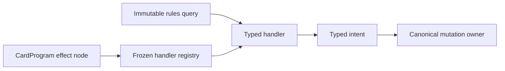

# Typed semantic handlers

Typed semantic handlers execute one immediate CardProgram instruction. They
translate a validated typed node and bounded immutable rules query into typed
intents. Canonical engine or focused mutation owners commit those intents.
Handlers never receive mutable `GameState`, private projections, persistence
objects, or unrestricted engine access.

Every registration declares a stable handler ID, schema version, exact
operation family, rule references, and bounded capability dependencies.
Duplicate ownership and unknown capabilities are rejected. Malformed input to
a registered operation is a rules error and cannot fall back to permissive
string dispatch. Strict preflight fingerprints the registry and recomputes its
capability closure.

Family modules own lowering; the aggregate registry owns only discovery and a
stable inventory. A handler may request a narrowly defined continuation for a
choice or replacement-aware transaction, but it may not retain mutable state
or commit around the canonical owner. Rollback must leave no partial mutation.

The fixed optional-effect choice handler accepts exactly one already represented
atomic instruction for the resolving controller. It exposes only apply or
decline, commits nothing before the response, and on acceptance prepends the
unchanged typed instruction so its existing semantic or choice owner performs
all validation and mutation. The wrapper rejects unknown operations, changed
chooser identity, extra fields, and nested optional wrappers. Specialized
optional choices such as fixed counter placement retain their historical
operation and replay identity rather than being rewritten through this owner.

A fixed semantic-choice life gain uses `LifeChangeIntent` rather than writing a
life total directly. The intent host prepares the canonical life-change batch;
when multiple replacements apply, the ordinary private replacement task stores
a closed life-intent identity and resumes only that uncommitted intent. The
continuation decoder rejects unknown intent kinds and changed identity, and
exact replay reissues the same semantic response and replacement selection.

Behavior that participates in later events—replacements, prevention, static
effects, and other persistent descriptors—belongs to
[runtime components](runtime-components.md), not this boundary. Family-specific
mutation and ordering contracts belong in subsystem documents such as
[drawing](drawing.md), [damage](damage.md), [prevention](prevention.md), and
[counter placement](counter-placement.md). Direct permanent destruction,
permanent exile, battlefield return-to-owner-hand, and closed own-graveyard
card-return instructions lower through strict handlers into identity-pinned
transactions; none reparses Oracle text or owns the underlying counter or zone
mutation. Broad legacy exile and return operations remain separate because they
represent other origins, destinations, quantities, choices, or hidden-zone
movement outside these closed direct-target grammars.

The `effect.public-zone-move` family closes a broader but still typed boundary.
One handler accepts exactly one public graveyard-card reference; the other
accepts an immutable fixed affected-set descriptor with public origin,
destination, owner/controller relation, source exclusion, and closed
`ObjectQuerySpec`. Both lower to intents and delegate stale-identity checks,
replacement ordering, simultaneous movement, new incarnations, normalized
events, Commander choices, projection, and journaling to existing owners.
Dynamic characteristic counts and linked or delayed movement never enter this
handler family.

Fixed regeneration lowers through one strict versioned handler. It preserves a
logical-object pin for the source form and accepts only an already-resolved
public direct-target or current/LKI attachment reference for the other forms.
The regeneration owner creates public until-cleanup shield state; the
destruction transaction consumes it for represented effect or damage
state-based destruction and coordinates tapping, damage removal, and combat
removal. Exact cannot-be-regenerated destruction carries a boolean on that same
transaction, making regeneration inapplicable without consuming its shield or
changing Indestructible and shield-counter behavior. An ordinary simultaneous
shield-counter choice still fails before mutation until the affected-player
ordering continuation is represented.

The direct-target compiler families share structural builders for their one
effect, closed target schema, and mechanics tuple, while each family retains
its own grammar and capability owner. Their runtime handlers likewise share
strict operation, reference, reason, and immutable replacement-selection field
validation. This shared code does not choose a target, infer a card family, or
create a generic move operation.

The fixed homogeneous target-set handlers receive only the already selected
and resolution-revalidated public references. Destruction delegates the whole
surviving set to the canonical destruction transaction; exile and return use
one simultaneous replacement-aware zone-move intent; tap and untap use one
typed set intent over the canonical tap-state owner. Empty up-to selections are
valid no-ops, while duplicate references, excess references, unknown fields,
and replacement selections on tap-state operations fail before mutation.

Mandatory direct stack counters lower through a separate strict handler to one
typed intent. The focused stack owner performs counterability, stack removal,
replacement-aware physical spell movement, normalized pre-counter and
post-graveyard event dispatch, and journaling; target legality and source exclusion
come from the same closed schema used by action offers. The exact intrinsic
sentence “This spell can't be countered” is compiled once as a trusted
stack-active declaration and pinned during cast commit. Conditional counter
clauses, countered ability and spell-copy look-back triggers, and broader
prohibitions remain residual rather than falling back to runtime Oracle parsing.

To migrate an instruction, characterize existing output and replay, define the
smallest typed node/query/intent surface, register one stable handler, add
success and malformed-input rollback tests, and remove every parallel dispatch
path. Registration does not itself raise the trust level of any CardProgram.

See [ADR 0006](../adr/0006-typed-semantic-handler-boundary.md),
[ADR 0009](../adr/0009-typed-tap-state-mutation-owner.md), and
[ADR 0014](../adr/0014-typed-semantic-choice-and-effect-ownership.md),
[ADR 0027](../adr/0027-typed-permanent-destruction.md),
[ADR 0028](../adr/0028-typed-return-to-owner-hand.md),
[ADR 0029](../adr/0029-typed-permanent-exile.md),
[ADR 0030](../adr/0030-typed-stack-counter.md), and
[ADR 0053](../adr/0053-typed-own-graveyard-return-to-hand.md).
