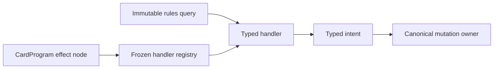

# Typed semantic handlers

Typed semantic handlers execute one immediate CardProgram instruction. They
translate a validated typed node and bounded immutable rules query into typed
intents. Canonical engine or focused mutation owners commit those intents.
Handlers never receive mutable `GameState`, private projections, persistence
objects, or unrestricted engine access.

```mermaid
flowchart LR
    Node["CardProgram effect node"] --> Registry["Frozen handler registry"]
    Query["Immutable rules query"] --> Handler["Typed handler"]
    Registry --> Handler
    Handler --> Intent["Typed intent"]
    Intent --> Owner["Canonical mutation owner"]
```

Every registration declares a stable handler ID, schema version, exact
operation family, rule references, and bounded capability dependencies.
Duplicate ownership and unknown capabilities are rejected. Malformed input to
a registered operation is a rules error and cannot fall back to permissive
string dispatch. Strict preflight fingerprints the registry and recomputes its
capability closure.

Family modules own lowering; the aggregate registry owns only discovery and a
stable inventory. A handler may request a narrowly defined continuation for a
choice or replacement-aware transaction, but it may not retain mutable state
or commit around the canonical owner. Rollback must leave no partial mutation.

The existing generic direct-control operations share the authoritative control
and acquisition-history owner. An indefinite control instruction invalidates
an older end-of-turn restoration even when it names the current controller.
Temporary control captures the previous restoration before that shared commit
and reinstates only its own explicit duration afterward. Cleanup therefore
restores the latest indefinite boundary, not an obsolete controller. This
bounded legacy-operation correction adds no printed control grammar or general
layer-2/attachment-control capability. Current command replay is separate from
historical execution; records declaring incompatible runtime trust are rejected
instead of being reinterpreted under the corrected cleanup behavior.

The fixed optional-effect choice handler accepts one already represented atomic
instruction or one validated linked exile/return phase pair for the resolving
controller. It exposes only apply or
decline, commits nothing before the response, and on acceptance prepends the
unchanged typed instruction so its existing semantic or choice owner performs
all validation and mutation. The wrapper rejects unknown operations, changed
chooser identity, extra fields, and nested optional wrappers. Specialized
optional choices such as fixed counter placement retain their historical
operation and replay identity rather than being rewritten through this owner.

The public resolution-condition handler receives one immutable result from the
canonical public-state query at the current instruction boundary. A known false
condition skips its result; an unavailable fact rejects instead of becoming
false. A known true condition prepends the unchanged typed result to the normal
continuation, so private choices and replacements resume after the committed
prefix without rerunning it or rechecking the condition at arbitrary later
state. It creates no decision, mutation owner, or independent query engine.

The linked exile/return coordinator delegates both simultaneous movements to
the existing zone owner. Exile commits and records only resulting exiled card
incarnations on the resolving stack item. Return or delayed-trigger creation
is a separate instruction, so a prospective-entry replacement choice resumes
only the uncommitted return. Delayed return uses one ordinary controller-locked
trigger with the exact exiled identities; departure and reentry invalidate
those identities. Entry counters use the canonical nested replacement tree,
and immediate keyword riders use the ordinary incarnation-locked layer journal.
No state-based action runs between an immediate exile and return. In particular,
Commander exile-to-command choice happens after immediate blink finishes, but
may remove a delayed-return card from exile. Old records retain their pinned
trust provenance; this new grammar does not reinterpret historical records.

Linked target cardinality is independent of source exclusion. The compiler
captures an up-to bound and an other-object qualifier before canonicalizing
the subject. Selecting zero targets remains legal with or without eligible
objects and is not a later optional-effect decline. Mandatory another-target
instructions still require their target, and offers and commands share the
same typed target schema.

The existing optional-payment choice also accepts a closed v2 fixed-cost
descriptor. It uses the ordinary private/public object choice and resource
affordability snapshot, pins selected zone incarnations, and returns only
canonical full-payment intents before prepending independently represented
consequences. A redirected discard or sacrifice still pays the chosen cost;
optional object costs publish disjoint permitted cardinalities, so decline and
full payment are the only executable alternatives rather than an inclusive
selection range. Omitted cardinality metadata retains existing range choices.
checkpoint replacement resumption reconstructs the same intent and runs the
result once. Decline changes no cost/result state, and a mandatory sibling
outside the descriptor remains outside its choice. Historical v1 payment
payloads keep their prior preparation/completion path. Current candidate lists
use stable public-reference ordering before continuation storage so checkpoint
hydration cannot change command hashes. Historical payload execution is separate
from historical record replay: records with incompatible runtime trust provenance
are rejected explicitly before loading, rather than recompiled under current
semantics.

A fixed semantic-choice life gain uses `LifeChangeIntent` rather than writing a
life total directly. The intent host prepares the canonical life-change batch;
when multiple replacements apply, the ordinary private replacement task stores
a closed life-intent identity and resumes only that uncommitted intent. The
continuation decoder rejects unknown intent kinds and changed identity, and
exact replay reissues the same semantic response and replacement selection.

The existing counter-unless-payment choice additionally accepts a closed v2
controller-payment descriptor. It locks the current target's controller for
the private choice, validates the complete mana vector and current target at
completion, and keeps the countering source controller separate from the
payer. Canonical mana intents perform payment; canonical counter intents
perform decline consequences. Announced X is resolved by the existing scalar
owner before preparing the choice, including zero. Current save/load and
exact replay preserve the choice and remaining instructions. Historical v1
payload execution remains separate; incompatible archived records are
rejected by the existing runtime-trust provenance boundary.

Scalar effect quantities reuse the value resolver before their unchanged
operation handlers run. Referenced characteristics use current information for
the same logical object in its expected public zone, otherwise its immediate
departure LKI. The canonical zone batch's existing characteristic checkpoint
pins relevant pending references before any member moves; source activation costs and
departure triggers seed the same stack-context snapshots. Committed trigger
amounts retain the normalized result event, not a later total or replacement
request. Public-history quantities read the current canonical journal for the
stack object's locked controller. Explicit declarations cache one value across
sibling results and resumption; independent instructions still read separately.
Malformed continuations, unavailable characteristics, and unrepresented history
fail closed. No new mutation owner, zone event, history registry, or runtime
Oracle interpretation participates in this path.

Departure relevance is determined from object identity, expected incarnation,
and public zone before a pending characteristic is evaluated. Empty departure
groups and unrelated references neither read values nor initialize continuation
caches. A pending reference's own availability check remains authoritative when
its instruction resolves; unavailable phasing interactions do not reject an
unrelated earlier movement. Relevant failures still restore all stack contexts
through the canonical zone owner's transaction boundary.

Public collection amounts retain the existing fixed draw, life, damage, token
and characteristic result owners. Closed current quantities use the same
cycle-safe characteristic boundary as static modifiers and definitions. A
fixed token instruction "for each" lowers its quantity without widening the
token definition or inferring a linked-result set. Declared values keep one
instruction-scoped value across suspension; independent instructions still
read separately. Unsupported quantities and unavailable matched values fail
closed before mutation.

Token-copy creation replacements inspect the source's copiable types and
subtypes, or the explicit copiable snapshot already supplied by its producer.
The replacement subject therefore describes the token that will enter, not
ordinary animation or type-changing effects currently applied to the source.
The existing token transaction still owns replacement ordering, copied-value
materialization, entry preparation and commit. Fixed copy recipes bind source,
target or normalized event-object identity before current-or-immediate-LKI
reads; unrelated departures never inspect pending copy instructions. Fixed
exceptions become copiable values, while separately granted Haste uses the
existing incarnation-pinned continuous-effect owner with its stated duration.
Independent next-end-step cleanup records actual created incarnations and uses
one filtered simultaneous sacrifice or exile through the zone transaction.
The token owner seals entry facts for the actual replacement-adjusted group,
records every member's entry history, and only then discovers creation and entry
triggers. Copy exceptions, intrinsic entry modifications and applicable static
effects contribute to entry facts; a separately instructed keyword grant does
not retroactively change those facts. Subsequent grants run after discovery
without priority or a state-based checkpoint, and trigger placement remains
deferred through the existing APNAP batch owner. Independent creation
instructions remain sequential, including zero actual creations. Printed
Haste-qualified entry observers remain residual; event-data diagnostics do not
expand that grammar.
Copied recurring abilities remain ordinary typed granted triggers. Populate
chooses only a currently controlled creature token, including the known-empty
case, through the existing choice and token owners. Historical descriptor
readability does not establish historical execution compatibility.

Tap-state occurrences are emitted only for actual committed state changes.
The canonical tap owner seals object incarnation, controller, characteristics,
and attack-declaration cause. Explicit simultaneous instructions and costs
commit their complete group before discovery; the ordinary APNAP owner places
the resulting abilities. Untap-step triggers remain held until upkeep priority.
No-op changes, entering in a tap state, stun-replaced untaps, and rollback do not
trigger. A real untap cost is distinct from rollback. Fixed event-controller
life, damage, and Mill results are nontargeted and retain the occurrence's
controller; they never create a target selection. First-time, once-per-turn,
and independently unsupported bodies remain residual.

Behavior that participates in later events—replacements, prevention, static
effects, and other persistent descriptors—belongs to
[runtime components](runtime-components.md), not this boundary. Family-specific
mutation and ordering contracts belong in subsystem documents such as
[drawing](drawing.md), [damage](damage.md), [prevention](prevention.md), and
[counter placement](counter-placement.md). Direct permanent destruction,
permanent exile, battlefield return-to-owner-hand, and closed own-graveyard
card-return instructions lower through strict handlers into identity-pinned
transactions; none reparses Oracle text or owns the underlying counter or zone
mutation. Broad legacy exile and return operations remain separate because they
represent other origins, destinations, quantities, choices, or hidden-zone
movement outside these closed direct-target grammars.

The `effect.public-zone-move` family closes a broader but still typed boundary.
One handler accepts exactly one public graveyard-card reference; the other
accepts an immutable fixed affected-set descriptor with public origin,
destination, owner/controller relation, source exclusion, and closed
`ObjectQuerySpec`. Both lower to intents and delegate stale-identity checks,
replacement ordering, simultaneous movement, new incarnations, normalized
events, Commander choices, projection, and journaling to existing owners.
Dynamic characteristic counts and linked or delayed movement never enter this
handler family.

Fixed regeneration lowers through one strict versioned handler. It preserves a
logical-object pin for the source form and accepts only an already-resolved
public direct-target or current/LKI attachment reference for the other forms.
The regeneration owner creates public until-cleanup shield state; the
destruction transaction consumes it for represented effect or damage
state-based destruction and coordinates tapping, damage removal, and combat
removal. Exact cannot-be-regenerated destruction carries a boolean on that same
transaction, making regeneration inapplicable without consuming its shield or
changing Indestructible and shield-counter behavior. An ordinary simultaneous
shield-counter choice still fails before mutation until the affected-player
ordering continuation is represented.

The direct-target compiler families share structural builders for their one
effect, closed target schema, and mechanics tuple, while each family retains
its own grammar and capability owner. Their runtime handlers likewise share
strict operation, reference, reason, and immutable replacement-selection field
validation. This shared code does not choose a target, infer a card family, or
create a generic move operation.

The fixed homogeneous target-set handlers receive only the already selected
and resolution-revalidated public references. Destruction delegates the whole
surviving set to the canonical destruction transaction; exile and return use
one simultaneous replacement-aware zone-move intent; tap and untap use one
typed set intent over the canonical tap-state owner. Empty up-to selections are
valid no-ops, while duplicate references, excess references, unknown fields,
and replacement selections on tap-state operations fail before mutation.
Battlefield return leaves accept the shared closed direct-permanent predicate;
own-graveyard return leaves accept fixed type, subtype, supertype, color, and
color-cardinality fields on the existing owner-scoped card target. Optional,
sequence, and homogeneous consumers reuse those same typed leaves. No return
handler receives Oracle prose or adds a parallel zone-mutation path.

Fixed controlled characteristic effects do not register a new family-specific
static component. Resolution snapshots one closed query through the canonical
effective-characteristic boundary, commits supported keyword additions as
ordinary layer-6 operations, and commits any fixed power/toughness delta as an
ordinary layer-7c operation over the identical locked identities. Static
ability addition and removal therefore retain the shared applicability and
timestamp ordering rules; the duration owner does not special-case whether an
ability came from a static or resolving source.

Mandatory direct stack counters lower through a separate strict handler to one
typed intent. The focused stack owner performs counterability, stack removal,
replacement-aware physical spell movement, normalized pre-counter and
post-graveyard event dispatch, and journaling; target legality and source exclusion
come from the same closed schema used by action offers. The exact intrinsic
sentence “This spell can't be countered” is compiled once as a trusted
stack-active declaration and pinned during cast commit. Conditional counter
clauses, countered ability and spell-copy look-back triggers, and broader
prohibitions remain residual rather than falling back to runtime Oracle parsing.

To migrate an instruction, characterize existing output and replay, define the
smallest typed node/query/intent surface, register one stable handler, add
success and malformed-input rollback tests, and remove every parallel dispatch
path. Registration does not itself raise the trust level of any CardProgram.

See [ADR 0006](../adr/0006-typed-semantic-handler-boundary.md),
[ADR 0009](../adr/0009-typed-tap-state-mutation-owner.md), and
[ADR 0014](../adr/0014-typed-semantic-choice-and-effect-ownership.md),
[ADR 0027](../adr/0027-typed-permanent-destruction.md),
[ADR 0028](../adr/0028-typed-return-to-owner-hand.md),
[ADR 0029](../adr/0029-typed-permanent-exile.md),
[ADR 0030](../adr/0030-typed-stack-counter.md), and
[ADR 0053](../adr/0053-typed-own-graveyard-return-to-hand.md).
